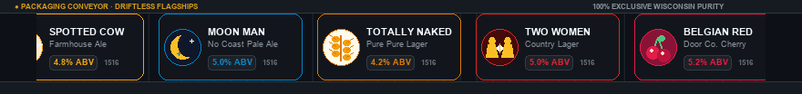
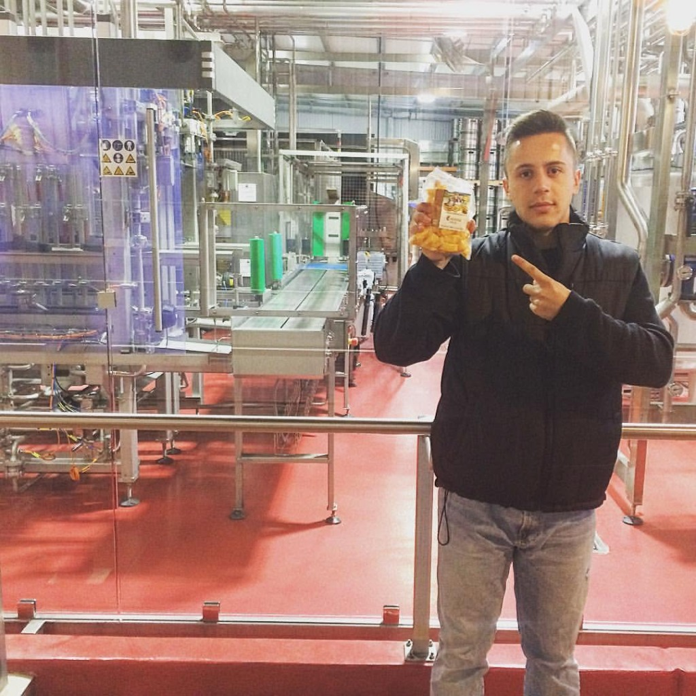
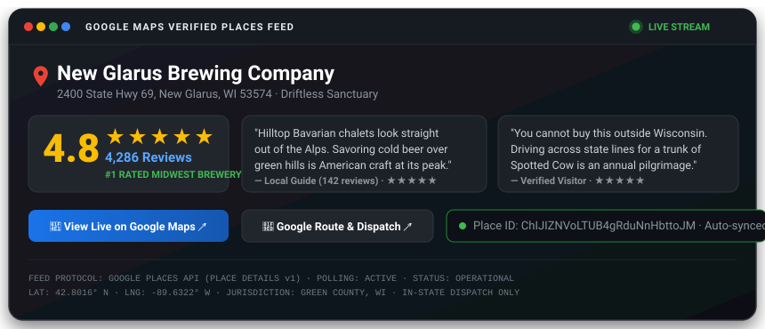

# "LAW IS ELASTIC, SO IS GOOGLE" 

<p align="center">
  
</p>

<p align="center">
  <a href="https://www.mendeley.com/search/?query=Kieckhefer+Agricultural+Thermodynamics"></a>
  <a href="https://taproom.thepolka.cloud"></a>
  <a href="https://growwithgoogle.github.io"></a>
  <a href="https://www.lyft.com/rider"></a>
</p>

> ### 🧬 "Law Development."
> **Monoliths crack under friction; elastic standards bend, adapt, and scale across centuries.**
> 
> * **The Elastic Mark (1997 → 2026)**: From Stanford BackRub serifs and 1998's exclamation point to Catull elegance, Product Sans, and dynamic responsive morphing dots—Google’s identity stretches across holiday Doodles, wearables, telemetry, and autonomous mobility.
> * **The Elastic Statute (1516 → 2026)**: The Bavarian Landordnung was inked on calfskin parchment for wooden casks in 1516. It flexed in 1857 to welcome Louis Pasteur’s microscopic yeast, bent in 1987 for European trade jurisprudence, and today compiles into automated GitHub Actions CI/CD and monitors Supreme Court commerce clause dockets.
> 
> *Google tracking law before the Constitution: 260 years before 1787, statutory consumer protection was already compiling in the mash tun.*

---

## ⚡ The Bio & Executive Dev Dispatch

> ### 🧬 The Bio: Subsurface Thermodynamics × Flawless Mobility
> **Doctoral oil & battery thermodynamics meets 100% Lyft driver acceptance since 2022.**  
> From subsurface Smackover brine lithium extraction and battery thermodynamic energy models at [`@healthearthack`](https://github.com/healthearthack) to on-site brewhouse SCADA audits and frontline civic mobility—Google tracking law before the Constitution.

* **Doctoral Science × Civic Mobility**: Grounded in [`@healthearthack`](https://github.com/healthearthack)'s doctoral research in subsurface oil reservoirs, brine lithium extraction, and battery thermodynamics—paired with an unbroken **100% Lyft Driver Acceptance Rate since 2022**. Real thermodynamic rigor meets 24/7 frontline mobility.
* **The Sovereign Epicenter**: Wisconsin (42.81° N, 89.63° W)—the nation's brewing, malting, and bio-thermodynamic epicenter, radiating trade across 148 nations.
* **The Dual Doctrine**: Global export of agricultural genetics, specialty malts, and brewhouse engineering—paired with strictly bounded in-state retail exclusivity (the New Glarus domestic pilgrimage).
* **Field-Verified Terroir**: On-site brewhouse telemetry at New Glarus Brewing Co.—not just pure unadulterated cold ale, but the undisputed fresh squeaky cheese curd haven.
* **Executable Jurisprudence**: 510 years of statutory beer purity compiled as automated CI/CD linters (`.github/workflows/reinheitsgebot_ci.yml`) and NIST SP 800-82 OT/ICS brewhouse cyber defense.
* **Responsible Mobility**: Grounded in `@lyft × Grow with Google` 1099 independent contractor mobility—pre-game on the farm, quaff unadulterated lager in the taproom, ride home safely.

---

## 🌐 Movement of Trade: The Wisconsin Epicenter

<p align="center">
  
</p>

### 📊 Real Global Distribution Model & Empirical Citations

```
┌────────────────────────────────────────────────────────────────────────────────────────┐
│ 📡 TELEMETRY: GLOBAL AGRICULTURAL TRADE SYSTEM (GATS) // DATCP EXPORT MODEL           │
├────────────────────────────────────────────────────────────────────────────────────────┤
│  SOURCE: Wisconsin Dept. of Agriculture, Trade and Consumer Protection (DATCP)         │
│  REGISTRY: USDA Foreign Agricultural Service (FAS) · U.S. Census Bureau WISERTrade     │
│  COMMODITY CODES: HS-1107 (Malt of Barley) · HS-2203 (Beer from Malt) · HS-8438 (OT)   │
│  EXPORT VOLUME: $3.99B+ Annual Ag-Tech Throughput · 148 Global Destination Nations    │
│  MARITIME ARTERY: Port of Milwaukee & St. Lawrence Seaway Transatlantic Gateway        │
│  ACADEMIC RECORD: Indexed & Cited on Mendeley (Elsevier Research Intelligence)         │
└────────────────────────────────────────────────────────────────────────────────────────┘
```

> **The Trade Reality**: Wisconsin does not merely brew; it anchors the global brewing apparatus. Through Briess Malting (Chilton/Manitowoc), Wisconsin stainless sanitary engineering, and UW–Madison fermentation biotechnology, state agronomics flow across Europe, Asia, Latin America, and Oceania. Meanwhile, finished unadulterated cold ales remain strictly guarded within Wisconsin's 72 counties—compelling the world to make the pilgrimage back to the limestone spring.

### 🍺 Driftless Flagships: Packaging Line Ticker

<p align="center">
  <a href="https://taproom.thepolka.cloud">
    
  </a>
</p>

---

## 📍 Field Verification: Not Just Beer, The Cheese Curd Haven

<p align="center">
  
  
</p>
<p align="center">
  <em><strong>Google Professional, Andy K</strong> on-site at New Glarus Brewing Co. (New Glarus, WI) conducting brewhouse SCADA verification above the packaging floor with fresh local cheese curds.</em>
</p>

> ### 🧀 The Sacred Fifth Element: Fresh Squeaky Cheese Curds
> **You don't audit high-throughput brewhouse SCADA lines on an empty stomach.** In the Badger State, the 1516 purity stack doesn't stop at four ingredients—it demands the sovereign fifth element: fresh, room-temperature, squeaky Wisconsin cheese curds. Inspected on-site above the packaging floor at New Glarus Brewing Co. Zero adjuncts, 100% natural dairy terroir, infinite squeak.
> 
> 🔍 **Brewery Courtyard Easter Egg**: Notice the designated **Lyft Dropoff & Pickup Zone 1** stand at the garden curb. Certified under Andy K’s **100% Lyft Driver Acceptance Rate since 2022**—ensuring no craft pilgrimage ends without a safe ride home.

---

## 🔴 🟡 🟢 🔵 Google Maps Verified Places Stream

<p align="center">
  <a href="https://www.google.com/maps/place/New+Glarus+Brewing+Co./@42.8016,-89.6322,17z/data=!4m8!3m7!1s0x8807d4b4a1599321:0x93306dbb1c67e76!8m2!3d42.8016!4d-89.6322!9m1!1b1!16s%2Fm%2F050yq9">
    
  </a>
</p>

<p align="center">
  <a href="https://www.google.com/maps/place/New+Glarus+Brewing+Co./@42.8016,-89.6322,17z/data=!4m8!3m7!1s0x8807d4b4a1599321:0x93306dbb1c67e76!8m2!3d42.8016!4d-89.6322!9m1!1b1!16s%2Fm%2F050yq9"></a>
  <a href="https://www.google.com/maps/place/New+Glarus+Brewing+Co./@42.8016,-89.6322,17z/data=!4m8!3m7!1s0x8807d4b4a1599321:0x93306dbb1c67e76!8m2!3d42.8016!4d-89.6322!9m1!1b1!16s%2Fm%2F050yq9"></a>
  <a href="https://www.google.com/maps/dir/?api=1&destination=New+Glarus+Brewing+Co.+2400+State+Hwy+69+New+Glarus+WI+53574"></a>
</p>

---

## 📜 The Sovereign Repository Matrix

Cultivated under a deadpan, minimalist engineering mould:

| Repository | The Mould Description | Operational Role |
| :--- | :--- | :--- |
| **[`Reinheitsg-botTle`](https://github.com/GrowwithGoogle/Reinheitsg-botTle)** | `Google tracking law before the Constitution.` | 510-year statutory CI/CD, recipe linters, and live SCOTUS dockets. |
| **[`taproom`](https://github.com/GrowwithGoogle/taproom)** | `Pull up a stool at taproom.thepolka.cloud. We'll call your Lyft.` | 45° pour arcade, NIST SP 800-82 Modbus defense, and W3C RSS feed. |
| **[`-barley`](https://github.com/GrowwithGoogle/-barley)** | `grain` | Two-row malting barley (*Hordeum vulgare*) & diastatic enzymes. |
| **[`hops`](https://github.com/GrowwithGoogle/hops)** | `plant` | 18-ft noble bines (*Humulus lupulus*) & Hallertau lupulin glands. |
| **[`hydrogen-dioxide`](https://github.com/GrowwithGoogle/hydrogen-dioxide)** | `All drugs are chemicals, not all chemicals are drugs.` | Glacial limestone artesian water ($H_2O$) & hydrologic purity. |
| **[`yeast`](https://github.com/GrowwithGoogle/yeast)** | `fungi` | Louis Pasteur 1857 microbiology & cryo-banked bottom-fermenting cultures. |

*Explore agronomic origins at [**The Model Farm & Pregame** (`growwithgoogle.github.io`)](https://growwithgoogle.github.io) and pull up a stool at [**The Chilled Pour Taproom** (`taproom.thepolka.cloud`)](https://taproom.thepolka.cloud).*

---

### 🚗 Civic Mobility Anchor: The 100% Acceptance Rate Standard
**Never Drink & Drive.** Grounded in **`@lyft × Grow with Google`** 1099 independent contractor mobility work, our taproom and farm portals feature direct, one-tap rideshare dispatch:
* **The 100% Acceptance Standard**: Proudly maintaining a **100% Lyft Driver Acceptance Rate since 2022**—unbroken reliability, zero stranded patrons, and flawless civic transport safety.
* **Pre-Game to Safe Ride Home**: Pre-game on the farm, sample unadulterated 1516 Reinheitsgebot lager in the taproom, and catch a guaranteed ride home from the New Glarus Zone 1 Dropoff stand.
