# HISTORICAL EXAMPLE BRAND EVOLUTION


# AИDY'S FORECAST MODERN WEATHER STORY

### Zero-Trust Synoptic Weather Engine · [PT:AC] Andy Kieckhefer

<p align="center">
  
</p>

---

## Synoptic evidence

**AИDY'S FORECAST** does not assign decorative weather effects arbitrarily.

The rendered calligraphy is derived from official **National Weather Service CONUS synoptic forecasts** obtained through `api.weather.gov` and the **NOAA Weather Prediction Center (WPC)**.

```text
NOAA CONUS synoptic grid
        ↓
regional forecast periods
        ↓
500hPa heights + surface fronts + precipitation
        ↓
synoptic classification (West → East)
        ↓
calligraphic rendering state
