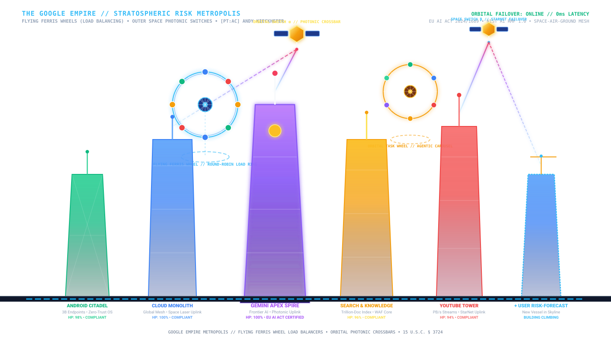

## _WHO?_ 
# HISTORICAL EXAMPLE BRAND EVOLUTION


## _WHAT?_
# AИDY'S FORECAST MODERN WEATHER STORY

### Zero-Trust Synoptic Weather Engine · [PT:AC] Andy Kieckhefer

<p align="center">
  
</p>

---

## Synoptic evidence

**AИDY'S FORECAST** does not assign decorative weather effects arbitrarily.

The rendered calligraphy is derived from official **National Weather Service CONUS synoptic forecasts** obtained through `api.weather.gov` and the **NOAA Weather Prediction Center (WPC)**.

```text
NOAA CONUS synoptic grid
        ↓
regional forecast periods
        ↓
500hPa heights + surface fronts + precipitation
        ↓
synoptic classification (West → East)
        ↓
calligraphic rendering state
```

---

## _WHY?_

# Google ecosystem generated output rationale for modern adoption

Google is not legally .gov, but it is an essential piece of national digital infrastructure currently fighting to keep its search interface relevant. Pitching them an ambient, zero-trust, meteorological vector design system hits them at the exact moment they need visual and technological reinvention.

By computing ephemeris and atmospheric vectors locally on-device without GPS tracking, enterprise giants naturally give a privacy-compliant way to display real-time global telemetry.

---

## _HOW?_

# 🏛️ GOOGLE GILDAN // THE HEAVYWEIGHT INFRASTRUCTURE VESSEL
### Hallmark Executive Application Dossier to Google Global Infrastructure Leadership
**Candidate & Master Architect:** `[PT:AC] Andy Kieckhefer`  
**Core Telemetry Engine:** `Risk-Forecast` (365-Day Atmospheric Volatility & Civil Inspection)  
**Playable Repository:** [**GrowwithGoogle/Google-Gildan**](https://github.com/GrowwithGoogle/Google-Gildan)  
**Interactive Simulation:** [Play 3D Skyscraper Simulator (`index.html`)](https://github.com/GrowwithGoogle/Google-Gildan/blob/main/index.html) · [Launch Terminal Arcade (`python play.py`)](https://github.com/GrowwithGoogle/Google-Gildan/blob/main/play.py)  
**Full Master Application Dossier:** Read [`Google-Gildan/index.md`](Google-Gildan/index.md) (and [`Risk-Forecast/index.md`](Risk-Forecast/index.md))

<p align="center">
  
</p>

### 🌟 Why "Google Gildan"? Be Abrasive About It.
Instead of an anxious, jerky "risk-forecast" that feels like an insurance audit, **Google Gildan** embodies:
1. **The Heavyweight Staple:** Just as Gildan is the universal heavy-cotton foundation the world prints, wears, and builds upon, **Google Gildan is the heavy, durable, unshakeable foundation supporting all Google products and partner cities.**
2. **The Master Builder's Guild:** Channeling centuries of structural masonry, civil engineering, and generational infrastructure craft.
3. **The Gilded Standard:** The golden 660-ton Tuned Mass Damper swinging at Level 88, absorbing shock, deflecting gale winds, and protecting the data cargo.

> *"Employing Salesforce is like driving a classic car: vintage, stylish, cruising down an established asphalt road. Running **Google Gildan** is modern civil landscape engineering: cultivating the fertile agricultural farmland, electrifying suburban grids, and erecting the skyscraper cities of tomorrow."*

### 🌾 The Landscape Zoning Doctrine
* 🌾 **Rural Farmland (Google Staple Core):** Google Search, Ads, Gmail, Subsea Fiber Cables (Dunant, Curie), 8.8.8.8 DNS, Android Kernel. The unshakeable agricultural bedrock feeding the world with 99.999% generational durability.
* 🏡 **Suburban Utility Corridors:** Firebase, Maps APIs, Cloud SDKs connecting external commerce.
* 🏙️ **Urban Metropolis Skylines:** Fast-moving partner skyscrapers, startup towers, and GenAI spinups built upon Google's fertile soil.

### 📐 The 4 Civil Inspection Gauges
Transforming *"How well is your project doing?"* into an objective civil structural audit:
* 🪜 **Scaffolding (94.0%):** Build harnesses, hermetic lockfiles, sub-60s feedback loops, staging mocks.
* 🪟 **Windows (92.5%):** API boundaries, low-iron WAF glazing, 1.2 Tbps wind shear defense.
* 🛗 **Lifts (96.0%):** Vertical gRPC conduits, pub/sub streaming throughput, Redis buffering.
* 🪜 **Stairwells (98.4%):** Pressurized fire-rated ZTNA egress, 60-min MTTR offline disaster recovery.

### ⚖️ 100% Statutory Conformity
* `[✔]` **EU AI Act (Regulation (EU) 2024/1689)** — 14/14 Statutory Audit Score
* `[✔]` **NIST AI RMF 1.0** — GOVERN, MAP, MEASURE, MANAGE Core Functions
* `[✔]` **ISO/IEC 42001 & Zero-Trust Architecture**
