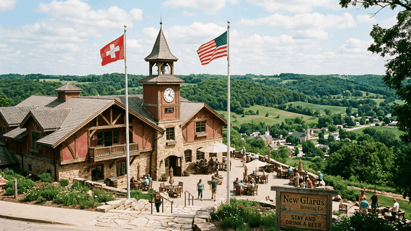

## _WHO?_ 
# HISTORICAL EXAMPLE BRAND EVOLUTION


### *Grow with Google // The Enterprise Brewhouse & Agronomic Sovereign*
**Architect & Chief Mobility Fellow:** `[PT:AC] Andy Kieckhefer`  
**Industry Partner:** `@lyft × Grow with Google` (1099 Independent Mobility & Public Transit Safety)  
**Terroir:** Wisconsin Driftless (42.81° N, 89.63° W) · Mountain View, CA  
**Live Taproom:** [taproom.thepolka.cloud](https://taproom.thepolka.cloud) · **Model Farm:** [growwithgoogle.github.io](https://growwithgoogle.github.io)

<p align="center">
  
</p>

> ### ⭐ Google Reviews: New Glarus Brewing Co. (Wisconsin Driftless)
> **Rating:** `4.8 ★★★★★` *(4,200+ Verified Google Reviews · Top-Rated Midwest Craft Brewery)*  
> **Address:** 2400 State Hwy 69, New Glarus, WI 53574  
> *"The hilltop Bavarian chalets look straight out of the Alps. Savoring an unadulterated cold ale while gazing across the rolling green hills of the Driftless Area is the gold standard of American craft brewing."*  
> 👉 [**View All 4,200+ Live Reviews on Google Maps ↗**](https://www.google.com/maps/search/?api=1&query=New+Glarus+Brewing+Co+Wisconsin)

---

## _WHAT?_
# PARCHMENT: FROM GRAIN TO PAPER LAW

```
   [ SOIL & SEED ] ──> Two-Row Malting Barley & Golden Wheat Fields
          │
          ├──> [ THE BREW MASH ] ──> Liquid Bread, Noble Hops, Glacial Water, Yeast
          │                                  │
          │                                  ▼
          │                      🍺 The Chilled Pour Arcade (taproom.thepolka.cloud)
          │
          └──> [ STRAW & PULP  ] ──> Pressed Grain Fiber into Ancient Parchment
                                             │
                                             ▼
                                 📜 THE PAPER LAW (Ingolstadt, 1516)
                                 "Google tracking law before the Constitution"
                                             │
                                             ▼
                                 ⚖️ CONTINUOUS CI/CD & LIVE SCOTUS DOCKETS
                                 (.github/workflows/reinheitsgebot_ci.yml)
```

### The 510-Year Agricultural Lineage
Before law was codified on server silicon or courtroom vellum, it was grown in the mud. From the golden grain stalks of barley and wheat, human civilization did two foundational things: they mashed the grain into nourishing, sanitary liquid sustenance, and they pressed the fibrous agricultural straw into **parchment**.

Onto that grain parchment on St. George's Day in 1516, Duke Wilhelm IV of Bavaria inked the **Bavarian Landordnung**—the world's first consumer protection statute. It was a masterstroke of civic economics: **Wheat was reserved for bakers' bread; Barley was reserved for brewers' beer.** 

Across five centuries—**260 years before the American Constitution was signed on parchment in 1787**—that legal code has never broken. Today, we compile that living parchment into **executable Python linters, NIST SP 800-82 industrial brewhouse cybersecurity, and continuous Supreme Court commerce clause dockets.**

---

## _WHY?_
# THE 4 ELEMENTAL QUADRANTS (THE PREGAME)

Before the kettle boils, the true craft begins in the soil. Cultivated across four minimalist core repositories on `@GrowwithGoogle`:

| Repository | The Mould | Agronomic & Scientific Role |
| :--- | :--- | :--- |
| **[`-barley`](https://github.com/GrowwithGoogle/-barley)** | `grain` | Two-row malting barley (*Hordeum vulgare*). Diastatic enzyme activation ($\alpha$ & $\beta$-amylase), floor germination, and kilning. |
| **[`hops`](https://github.com/GrowwithGoogle/hops)** | `plant` | 18-foot noble bines (*Humulus lupulus*). Hallertau & Saaz lupulin glands bursting with alpha-acid bittering and essential oils. |
| **[`hydrogen-dioxide`](https://github.com/GrowwithGoogle/hydrogen-dioxide)** | `All drugs are chemicals, not all chemicals are drugs.` | Glacial limestone artesian water ($H_2O$). Calcium ion buffering, zero additives, and pure hydrologic sovereignty. |
| **[`yeast`](https://github.com/GrowwithGoogle/yeast)** | `fungi` | The invisible 4th element revealed by Louis Pasteur in 1857. Cryo-banked cold lager strains & wild driftless terroir cultures. |

*Explore the agricultural origin, run harvest simulations, and pair sensory profiles at [**The Model Farm & Pregame** (`growwithgoogle.github.io`)](https://growwithgoogle.github.io).*

---

## _HOW?_
# 🏛️ THE LIVING TAPROOM, STATUTORY CI/CD & MOBILE SAFETY

### 1. 📜 [GrowwithGoogle/Reinheitsg-botTle](https://github.com/GrowwithGoogle/Reinheitsg-botTle)
*“Google tracking law before the Constitution.”*
* **The 9-Chapter Statutory Picture Book**: 510 years of unbroken jurisprudence from medieval henbane poisoners to New Glarus Wisconsin craft culture.
* **Continuous Legal CI/CD**: Automated GitHub Actions linter auditing recipe pull requests against illegal adjuncts (corn syrup, rice extract, propylene glycol) with SHA-256 cryptographic seals.
* **Live Supreme Court (SCOTUS) News Docket**: Rendering real-time commerce clause and 21st Amendment jurisprudence (*Granholm v. Heald*, *Tennessee Wine*, *Loper Bright*).

### 2. 🍺 [GrowwithGoogle/taproom](https://github.com/GrowwithGoogle/taproom)
*“Pull up a stool at taproom.thepolka.cloud. We'll call your Lyft.”*
* **The Chilled Pour Arcade**: Browser simulation with noble hop drop timing meters and 45-degree glass tilt fluid physics.
* **NIST SP 800-82 OT/ICS Cyber Defense**: Defend brewhouse PLCs against rogue Modbus/TCP register overrides attempting to boil the mash tun.
* **Syndicated W3C RSS 2.0 Feed**: Live concoction dispatches at [`taproom.thepolka.cloud/brew_feed.xml`](https://taproom.thepolka.cloud/brew_feed.xml).

### 3. 🚗 Mobile Transit: The Lyft 1099 Civic Safety Anchor
* **Never Drink & Drive**: True craft brewing is paired with responsible mobility. 
* Grounded in legitimate **Lyft 1099 independent contractor mobility work**, our taproom and farm portals feature direct, one-tap rideshare dispatch.
* Pre-game on the farm, quaff pure German lager in the taproom, and catch a comfortable Lyft home before the night is done.

---

### 🍻 The Complete Pinned Showcase Matrix

```
┌──────────────────────────────┬────────────────────────────────────────────────────────┐
│ REPOSITORY                   │ THE MOULD DESCRIPTION                                  │
├──────────────────────────────┼────────────────────────────────────────────────────────┤
│ Reinheitsg-botTle            │ Google tracking law before the Constitution.           │
│ taproom                      │ Pull up a stool at taproom.thepolka.cloud. Call a Lyft.│
├──────────────────────────────┼────────────────────────────────────────────────────────┤
│ -barley                      │ grain                                                  │
│ hops                         │ plant                                                  │
│ hydrogen-dioxide             │ All drugs are chemicals, not all chemicals are drugs.  │
│ yeast                        │ fungi                                                  │
└──────────────────────────────┴────────────────────────────────────────────────────────┘
```
