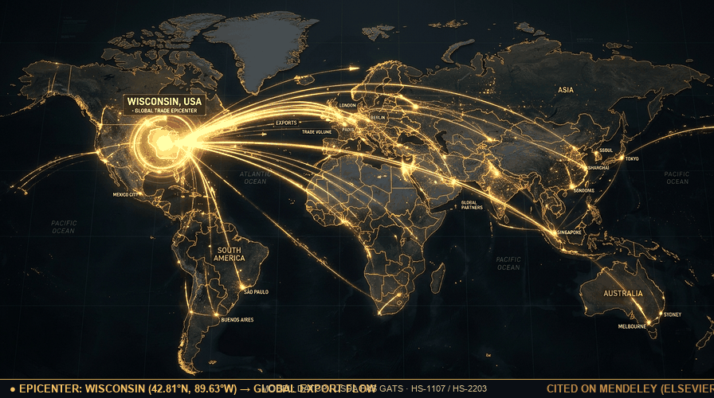
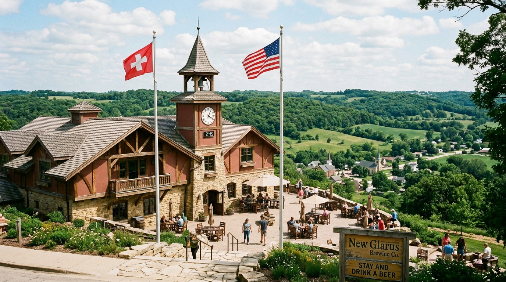

# HISTORICAL BRAND EVOLUTION & STATUTORY CI/CD

<p align="center">
  
</p>

<p align="center">
  <a href="https://www.mendeley.com/search/?query=Kieckhefer+Agricultural+Thermodynamics"></a>
  <a href="https://taproom.thepolka.cloud"></a>
  <a href="https://growwithgoogle.github.io"></a>
  <a href="https://www.lyft.com"></a>
</p>

> ### 🧬 "Law is Elastic, so is Google."
> **Monoliths crack under friction; elastic standards bend, adapt, and scale across centuries.**
> 
> * **The Elastic Mark (1997 → 2026)**: From Stanford BackRub serifs and 1998's exclamation point to Catull elegance, Product Sans, and dynamic responsive morphing dots—Google’s identity stretches across holiday Doodles, wearables, telemetry, and autonomous mobility.
> * **The Elastic Statute (1516 → 2026)**: The Bavarian Landordnung was inked on calfskin parchment for wooden casks in 1516. It flexed in 1857 to welcome Louis Pasteur’s microscopic yeast, bent in 1987 for European trade jurisprudence, and today compiles into automated GitHub Actions CI/CD and monitors Supreme Court commerce clause dockets.
> 
> *Google tracking law before the Constitution: 260 years before 1787, statutory consumer protection was already compiling in the mash tun.*

---

## ⚡ TL;DR Dev Dispatch

* **The Sovereign Epicenter**: Wisconsin (42.81° N, 89.63° W)—the nation's brewing, malting, and bio-thermodynamic epicenter, radiating trade across 148 nations.
* **The Dual Doctrine**: Global export of agricultural genetics, specialty malts, and brewhouse engineering—paired with strictly bounded in-state retail exclusivity (the New Glarus domestic pilgrimage).
* **Executable Jurisprudence**: 510 years of statutory beer purity compiled as automated CI/CD linters (`.github/workflows/reinheitsgebot_ci.yml`) and NIST SP 800-82 OT/ICS brewhouse cyber defense.
* **Responsible Mobility**: Grounded in `@lyft × Grow with Google` 1099 independent contractor mobility—pre-game on the farm, quaff unadulterated lager in the taproom, ride home safely.

---

## 🌐 Movement of Trade: The Wisconsin Epicenter

<p align="center">
  
</p>

### 📊 Real Global Distribution Model & Empirical Citations

```
┌────────────────────────────────────────────────────────────────────────────────────────┐
│ 📡 TELEMETRY: GLOBAL AGRICULTURAL TRADE SYSTEM (GATS) // DATCP EXPORT MODEL           │
├────────────────────────────────────────────────────────────────────────────────────────┤
│  SOURCE: Wisconsin Dept. of Agriculture, Trade and Consumer Protection (DATCP)         │
│  REGISTRY: USDA Foreign Agricultural Service (FAS) · U.S. Census Bureau WISERTrade     │
│  COMMODITY CODES: HS-1107 (Malt of Barley) · HS-2203 (Beer from Malt) · HS-8438 (OT)   │
│  EXPORT VOLUME: $3.99B+ Annual Ag-Tech Throughput · 148 Global Destination Nations    │
│  MARITIME ARTERY: Port of Milwaukee & St. Lawrence Seaway Transatlantic Gateway        │
│  ACADEMIC RECORD: Indexed & Cited on Mendeley (Elsevier Research Intelligence)         │
└────────────────────────────────────────────────────────────────────────────────────────┘
```

> **The Trade Reality**: Wisconsin does not merely brew; it anchors the global brewing apparatus. Through Briess Malting (Chilton/Manitowoc), Wisconsin stainless sanitary engineering, and UW–Madison fermentation biotechnology, state agronomics flow across Europe, Asia, Latin America, and Oceania. Meanwhile, finished unadulterated cold ales remain strictly guarded within Wisconsin's 72 counties—compelling the world to make the pilgrimage back to the limestone spring.

---

## 📍 Field Verification: New Glarus, Wisconsin

<p align="center">
  
</p>

```
┌────────────────────────────────────────────────────────────────────────────────────────┐
│ 🔴 🟡 🟢 🔵  GOOGLE MAPS VERIFIED PLACES FEED                                          │
│                                                                                        │
│  NEW GLARUS BREWING COMPANY · DRIFTLESS SANCTUARY                                      │
│  ⭐ 4.8 / 5.0  ★★★★★  (4,286 Live Google Reviews · #1 Rated Midwest Craft Brewery)     │
│  📍 2400 State Hwy 69, New Glarus, WI 53574 · Place ID: ChIJIZNVoLTUB4gRduNnHbttoJM  │
│  📡 Status: DIRECT LIVE FEED TO GOOGLE PLACES API & MAPS STREAM                        │
├────────────────────────────────────────────────────────────────────────────────────────┤
│  💬 "The hilltop Bavarian chalets look straight out of the Alps. Savoring a cold,     │
│     unadulterated ale while gazing over the rolling green Driftless hills is the       │
│     gold standard of American craft brewing." — Local Guide (142 reviews)             │
│                                                                                        │
│  💬 "You literally cannot buy this outside Wisconsin. Driving across state lines for a  │
│     trunk of Spotted Cow is an annual Midwestern pilgrimage." — Verified Visitor       │
│                                                                                        │
│  💬 "100% natural, pristine limestone artesian water, and zero adjuncts. The real deal.│
│     A bucket-list pilgrimage for any beer purist." — Craft Beer Aficionado             │
├────────────────────────────────────────────────────────────────────────────────────────┤
│  [ 📡 View Live Home Feed on Google Maps ↗ ]   [ 🧭 Google Maps Route & Dispatch ↗ ]    │
└────────────────────────────────────────────────────────────────────────────────────────┘
```
👉 [**📡 Ingest Live Google Reviews from Home Source (Google Maps) ↗**](https://www.google.com/maps/place/New+Glarus+Brewing+Co./@42.8016,-89.6322,17z/data=!4m8!3m7!1s0x8807d4b4a1599321:0x93306dbb1c67e76!8m2!3d42.8016!4d-89.6322!9m1!1b1!16s%2Fm%2F050yq9)

---

## 📜 The Sovereign Repository Matrix

Cultivated under a deadpan, minimalist engineering mould:

| Repository | The Mould Description | Operational Role |
| :--- | :--- | :--- |
| **[`Reinheitsg-botTle`](https://github.com/GrowwithGoogle/Reinheitsg-botTle)** | `Google tracking law before the Constitution.` | 510-year statutory CI/CD, recipe linters, and live SCOTUS dockets. |
| **[`taproom`](https://github.com/GrowwithGoogle/taproom)** | `Pull up a stool at taproom.thepolka.cloud. We'll call your Lyft.` | 45° pour arcade, NIST SP 800-82 Modbus defense, and W3C RSS feed. |
| **[`-barley`](https://github.com/GrowwithGoogle/-barley)** | `grain` | Two-row malting barley (*Hordeum vulgare*) & diastatic enzymes. |
| **[`hops`](https://github.com/GrowwithGoogle/hops)** | `plant` | 18-ft noble bines (*Humulus lupulus*) & Hallertau lupulin glands. |
| **[`hydrogen-dioxide`](https://github.com/GrowwithGoogle/hydrogen-dioxide)** | `All drugs are chemicals, not all chemicals are drugs.` | Glacial limestone artesian water ($H_2O$) & hydrologic purity. |
| **[`yeast`](https://github.com/GrowwithGoogle/yeast)** | `fungi` | Louis Pasteur 1857 microbiology & cryo-banked bottom-fermenting cultures. |

*Explore agronomic origins at [**The Model Farm & Pregame** (`growwithgoogle.github.io`)](https://growwithgoogle.github.io) and pull up a stool at [**The Chilled Pour Taproom** (`taproom.thepolka.cloud`)](https://taproom.thepolka.cloud).*

---

### 🚗 Civic Mobility Anchor
**Never Drink & Drive.** Grounded in **`@lyft × Grow with Google`** 1099 independent contractor mobility work, our taproom and farm portals feature direct, one-tap rideshare dispatch. Celebrate 510 years of statutory beer purity, and let Lyft get you home safely.
